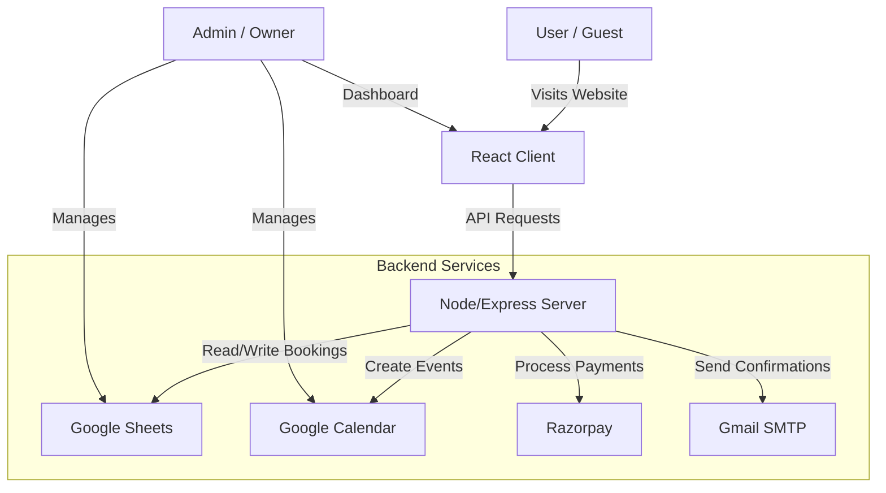

# Developer Guide & Architecture Overview

Welcome to the **Krish Homestay** project! This guide is designed to help new developers understand how the system works, how the different pieces fit together, and how to make changes safely.

## 1. Project Overview

**Krish Homestay** is a full-stack web application for booking homestay accommodation.
Unlike traditional apps that use a SQL database, this project uses **Google Sheets** as its primary database and **Google Calendar** for availability management. This makes it easy for non-technical owners to manage bookings directly from Google Workspace tools they already know.

### Key Technologies
*   **Frontend**: React (Vite), CSS Modules.
*   **Backend**: Node.js, Express.
*   **Database**: Google Sheets (via Google Sheets API).
*   **Scheduling**: Google Calendar (via Google Calendar API).
*   **Payments**: Razorpay.
*   **Email**: Nodemailer (Gmail SMTP).

---

## 2. System Architecture

The application follows a simple Client-Server architecture.

---

## 3. Core Workflows

### A. The Booking Flow
This is the most critical part of the application.

1.  **Availability Check**:
    *   User selects dates in `BookingForm.jsx`.
    *   Frontend calls `GET /api/calendar-data`.
    *   Server fetches:
        *   **Bookings** from Google Sheets (to see what's taken).
        *   **Rules** (custom prices/blocked dates) from a local JSON file or Sheet.
    *   Frontend disables unavailable dates in the calendar.

2.  **Payment (Razorpay)**:
    *   User fills in details and clicks "Pay".
    *   Frontend calls `POST /api/create-payment-order` to generate a Razorpay Order ID.
    *   Razorpay Checkout modal opens.
    *   User completes payment.

3.  **Confirmation**:
    *   On success, Frontend calls `POST /api/bookings` with the payment signature.
    *   Server verifies the payment (optional but recommended step).
    *   Server:
        1.  **Adds Row** to Google Sheet (Bookings tab).
        2.  **Creates Event** in Google Calendar.
        3.  **Sends Email** to the guest and the owner.
    *   Frontend shows "Booking Confirmed" message.

### B. Admin & Pricing
*   **Dynamic Pricing**: Prices are not hardcoded. They are fetched from the backend.
*   **Blocking Dates**: The Admin Dashboard allows the owner to "Block" dates. These are stored as "Rules" (currently in `server/data/calendarRules.json` or similar logic) and prevent users from booking those days.

---

## 4. Directory Structure

### `client/` (Frontend)
*   `src/pages/`: Main views (Home, AdminDashboard, etc.).
*   `src/components/`: Reusable UI parts.
    *   `BookingForm.jsx`: **Critical**. Handles the calendar, validation, and payment initiation.
    *   `Navbar.jsx`: Navigation.
*   `src/config.js`: API URL configuration.

### `server/` (Backend)
*   `index.js`: Entry point. Sets up Express server.
*   `routes/api.js`: All API endpoints (`/bookings`, `/calendar-data`, etc.).
*   `services/`: Business logic separated from routes.
    *   `sheetsService.js`: Handles reading/writing to Google Sheets.
    *   `calendarService.js`: Handles Google Calendar events.
    *   `paymentService.js`: Razorpay integration.
    *   `emailService.js`: Sending emails.
*   `service-account.json`: **Secret**. Google Cloud credentials (do not commit this!).

---

## 5. Data Structure (Google Sheets)

The Google Sheet acts as the database. It **must** have a tab named `Bookings` with the following columns (order matters if code relies on indices, but usually headers are matched):

| Column | Header | Description |
| :--- | :--- | :--- |
| A | ID | Unique Booking ID |
| B | Guest Name | Name of the person booking |
| C | Email | Contact email |
| D | Phone | Contact number |
| E | Check In | YYYY-MM-DD |
| F | Check Out | YYYY-MM-DD |
| G | Guests | Number of people |
| H | Status | 'confirmed', 'cancelled' |
| I | Total Amount | Amount paid |
| J | Payment ID | Razorpay Payment ID |

---

## 6. How to Make Changes

### Adding a New Feature
1.  **Frontend**: Create the component in `client/src/components`.
2.  **Backend**: If it needs data, add a route in `server/routes/api.js`.
3.  **Service**: If it talks to Sheets/Calendar, add a function in the relevant `services/` file.

### Changing Content
*   **Text/Images**: Most content is in `client/src/pages/Home.jsx`.
*   **Amenities**: Updated in `Home.jsx`.

### Debugging
*   **Server Logs**: Check the terminal running `npm start` in `server/`. It logs errors from Sheets/Razorpay.
*   **Browser Console**: Check F12 > Console for frontend errors.

---

## 7. Important Notes for Developers
*   **Never commit `service-account.json` or `.env` files.** These contain sensitive keys.
*   **Google API Quotas**: The Sheets API has rate limits. The app caches data briefly or reads live. If traffic is huge, we might hit limits (unlikely for a homestay).
*   **Testing Payments**: Use Razorpay "Test Mode" keys. Do not use real cards in development.
